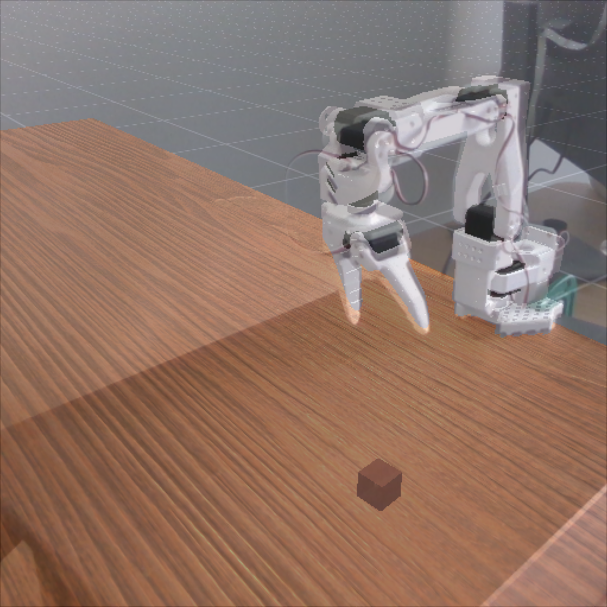

# SO101 Sim2Real

The tutorial heavily builds on top of [Lerobot-Sim2Real](https://github.com/StoneT2000/lerobot-sim2real/blob/main/docs/zero_shot_rgb_sim2real.md) but tailored for SO101. We will show an example on how to train a RGB based model controlling an SO101 robot arm in simulation and deploying that zero-shot in the real world to grasp cubes. 

LeRobot Sim2real provides code to train with Reinforcement Learning in fast GPU parallelized simulation and rendering via [ManiSkill](https://github.com/haosulab/ManiSkill) and deploy to the real-world. The codebase is designed for use with the [🤗 LeRobot](https://github.com/huggingface/lerobot) library, which handles all of the hardware interfacing code. Once you clone and follow the installation instructions you can try out the [zero-shot RGB sim2real tutorial](./docs/zero_shot_rgb_sim2real.md) to train in pure simulation something that can pick up cubes in the real world like below:

https://github.com/user-attachments/assets/ca20d10e-d722-48fe-94af-f57e0b2b2fcd

Note that this project is still in a very early stage. There are many ways the sim2real can be improved (like more system ID tools, better reward functions etc.), but we plan to keep this repo extremely simple for readability and hackability.


## Getting Started

Install this repo by running the following
```bash
conda create -n lerobot "python==3.11" # 3.11 is recommended
git clone https://github.com/Luoyadan/lerobot_so101-sim2real.git
cd lerobot && pip install -e . # this tutorial is using lerobot 0.3.4 (Sep 2025)
cd ../ManiSkill && pip install -e . # mani_skill 3.0.0b21
cd .. && pip install -e . # install sim2real
pip install torch # install the version of torch that works for you
```

The ManiSkill/SAPIEN simulator code is dependent on working NVIDIA drivers and vulkan packages. After running pip install above, if something is wrong with drivers/vulkan, please follow the troubleshooting guide here: https://maniskill.readthedocs.io/en/latest/user_guide/getting_started/installation.html#troubleshooting

To double check if the simulator is installed correctly, you can run 

```
python -m mani_skill.examples.demo_random_action
```


## Sim2Real Tutorial


### 0: Configure your LeRobot setup

First you should update the `lerobot_sim2real/config/real_robot.py` file to match your own configuration setup. You might need to change how the camera is setup and the ID of the robot. This allows the rest of the code to be able to control the real robot. Moreover you should double check that you have calibrated your real robot's hardware correctly. 

To find the camera indices of your camera, run
```
lerobot-find-cameras opencv # or realsense for Intel Realsense cameras
```
## 1: Setup your simulation and real world environment

We provide a pre-built [simulation environment called SO100GraspCube-v1](https://github.com/haosulab/ManiSkill/tree/main/mani_skill/envs/tasks/digital_twins/so100_arm/grasp_cube.py) that only needs a few minor modifications for your own use. If you are interested in making your own environments to then tackle via sim2real reinforcement learning we recommend you finish this tutorial first, then learn how to [create custom simulated tasks in ManiSkill](https://maniskill.readthedocs.io/en/latest/user_guide/tutorials/custom_tasks/index.html), then follow the tutorial on how to [design them for sim2real support](https://maniskill.readthedocs.io/en/latest/user_guide/tutorials/sim2real/index.html)

In this section we need to roughly align the real world and simulation environments. This means we need to decide where the robot is installed, and where the camera is relative to the robot. 

### 1.1: Setup simulation camera and object spawn region

First thing to do is to decide in simulation where to put the 3rd-view camera relative to the robot. The robot is always spawned at the 0 point of the simulation, at height "0" which is by default the top of the table surface you mount the robot on. This is what the default looks like in simulation and in the real world:


To make modifications you can just edit the "base_camera_settings"."pos" value in the `env_config.json` file in the root of the repository. We use this config file to modify environment defaults when training (you can pass in a different file path if you want). To visualize what you just did you can record a video of your environment being reset randomly to get a sense of where the camera is and see how the object positions are randomized.

```bash
python lerobot_sim2real/scripts/record_reset_distribution.py --env-id="SO101GraspCube-v1" --env-kwargs-json-path=env_config.json
```


You can also modify where the camera is pointing at in case it can't see the robot or enough of the workspace in simulation. Simply modify "base_camera_settings"."target" value accordingly, which is the 3D point the camera points at. Finally you can also modify the mean position cubes are spawned at as well as how large of a square area they are randomized in in the config file.

The default options for the sim settings are tested and should work so you can also skip modifying the simulation environment and go straight to setting up the real camera.

> [!NOTE]
> Occlusion can make grasping a cube harder. If you plan to modify the sim environment make sure the cube is always visible, close to the camera, and generally not behind the robot from the camera's perspective. If it isn't, you can modify the camera accordingly or also modify the spawn region for the cube in the env_config.json file. Moreover larger spawn region areas will take longer to learn to solve in simulation.


You might also notice that we often use `--env-id="SO101GraspCube-v1" --env-kwargs-json-path=env_config.json` in scripts. The codebase is built to support different environments and configurations so passing these tells those scripts which environment you want to work with and with what settings.

Before we start setting up the real camera you might also want to check if your robot's colors match the simulation one. The default is white parts and black motors, but you can modify the color by changing the "robot_color" part of the `env_config.json` file to either be "random" or a value like [0.1, 0.1, 0.1] for black colored robots.

```json
  "domain_randomization_config": {
    "robot_color": "random"
  }
```
Note: Using "random" for robot_color may result in slower convergence during training.

### 1.2: Roughly align the real world camera with the simulation camera

Next we need to roughly align the real world camera to match the position and orientation of the simulation one. To do so first mount your robot on a surface/table somewhere and make sure to mark down exactly where it is placed. Be prepared to unmount the robot later as we will need to take a picture of the background after camera alignment without the robot in the scene.

Then place the camera approximately where it is in simulation relative to the robot's base. The simulation always reports distances in meters. So if you define the position value of the camera to be `[0.7, 0.37, 0.28]`, try placing your real world camera at 0.7, 0.37 meters away (x/y axis or left/right/front/behind) and 0.28 meters above (z axis) the robot's base.

Next you can run the next script which will help you align the camera a bit. It will open a live window that overlays the simulation rendered image on top of the real world image. Your goal is to move and nudge the real world camera's position and orientation until you see the simulation and real world image overlay line up. Some cameras also have different intrinsics/fovs, while running this script you can also tune the field of view (FOV) value by pressing the left and right keys. This stage doesn't have to be perfectly done as we leverage domain randomization during RL training to support larger margins of error, but the closer the alignment the better. This is the hardest part of the tutorial and does take a little bit of practice. One recommendation to help make this easier is to first get a sense of how translation and rotation in the x, y, z axes of the real camera affect the overlay image and to slowly move in each direction one by one.

```bash
python lerobot_sim2real/scripts/camera_alignment.py --env-id="SO101GraspCube-v1" --env-kwargs-json-path=env_config.json
```

Two examples are shown below, both of which after RL training worked out fine and produced working real world deployable models. Note that there are obvious errors here but that's fine! 

> [!NOTE]
> Based on testing from the community, alignment that looks worse than the ones here will struggle a lot more to work during sim2real transfer. We recommend using a camera stand with multiple degrees of freedom in different axes and using your hand to slowly move the camera around until it lines up well. This does take some practice but once you get the hang of it it becomes much easier to do. It is possible to permit even more calibration error but will require more advanced techniques and modifications to training that we leave as open research problems.




## 1.3: Get an image for greenscreening to bridge the sim2real visual gap 

Once the camera looks well aligned, you need to take the robot off the surface/table and then take a picture of the background using the following script. It will save to a file `greenscreen.png`. If you can't unmount the robot, you can take the picture anyway and use photo editing tools or AI to remove the robot and inpaint the background.

```bash
python lerobot_sim2real/scripts/capture_background_image.py --env-id="SO101GraspCube-v1" --env-kwargs-json-path=env_config.json --out=greenscreen.png
```

Note that we still use the simulation environment here but primarily to determine how to crop the background image. If the sim camera resolution is 128x128 (the default) we crop the greenscreen image down to 128x128. Once the greenscreen.png file is saved, modify "greenscreen_overlay_path" key in the env_config.json file to include the path to that file.

After capturing a greenscreen image mount the robot back to where it was originally. If you want to double check you can run the camera alignment script with the green screen image supplied and nudge the real robot mount location until it lines up. Simply run the camera alignment script again after updating the "greenscreen_overlay_path" key in env_config.json.

```bash
python lerobot_sim2real/scripts/camera_alignment.py --env-id="SO101GraspCube-v1" --env-kwargs-json-path=env_config.json
```

This will then produce something like below. Again it is not perfect alignment but this can still work!


## 2: Visual Reinforcement Learning in Simulation

Now we get to train the robot we setup in the real world in simulation via RL. We provide a baseline training script for visual Proximal Policy Optimization (PPO), which accepts environment id and the env configuration json file so that we can train on an environment aligned with the real world. If you haven't already make sure to add the path to the greenscreen image in your env_config.json file.

For the SO101GraspCube-v1 environment we have the following already tuned script (uses about 8-10GB of GPU memory)

```bash
seed=3
python lerobot_sim2real/scripts/train_ppo_rgb.py --env-id="SO101GraspCube-v1" --env-kwargs-json-path=env_config.json \
  --ppo.seed=${seed} \
  --ppo.num_envs=1024 --ppo.num-steps=16 --ppo.update_epochs=8 --ppo.num_minibatches=32 \
  --ppo.total_timesteps=100_000_000 --ppo.gamma=0.9 \
  --ppo.num_eval_envs=16 --ppo.num-eval-steps=64 --ppo.no-partial-reset \
  --ppo.exp-name="ppo-SO101GraspCube-v1-rgb-${seed}" \
  --ppo.track --ppo.wandb_project_name "SO101-ManiSkill"
```

This will train an agent via RL/PPO and track its training progress on Weights and Biases and Tensorboard. Run `tensorboard --logdir runs/` to see the local tracking. Checkpoints are saved to `runs/ppo-SO101GraspCube-v1-rgb-${seed}/ckpt_x.pt` and evaluation videos in simulation are saved to `runs/ppo-SO101GraspCube-v1-rgb-${seed}/videos`. If you have more GPU memory available you can train faster by bumping the `--ppo.num_envs` argument up to 2048.

While training you can check out the eval videos which by default look like the following 4x4 grid showing 16 parallel environments:


Moreover, for this environment the evaluation result curves may look approximately like this during training.


## 3: Real World Deployment

Now you have a checkpoint you have trained and want to evaluate, place a cube onto the table in front of the robot. We recommend using cubes around 2.5cm in size since that is the average size the robot is trained to pick up in simulation. Furthermore we strongly recommend to be wary that you place the cube in a location that the robot was trained to pick from, which is dependent on your cube spawning randomization settings (if you aren't sure check the reset distribution video you generated in step 1).

Then you run your model on the real robot with the following. Note that each time the real environment needs to be reset you will be prompted in the terminal to do so and to press enter to start the next evaluation episode.

```bash
python lerobot_sim2real/scripts/eval_ppo_rgb.py --env_id="SO101GraspCube-v1" --env-kwargs-json-path=env_config.json \
    --checkpoint=path/to/ckpt.pt --no-continuous-eval --control-freq=15
```
or fast execution via:

```bash
python lerobot_sim2real/scripts/eval_ppo_rgb.py --env_id="SO101GraspCube-v1" --env-kwargs-json-path=env_config.json \
    --checkpoint=path/to/ckpt.pt --control-freq=30
```


## Acknowledgement
Thanks Stone for his significant contributions (https://github.com/StoneT2000/lerobot-sim2real).

If you find this project useful, give this repo and [ManiSkill](https://github.com/haosulab/ManiSkill) a star! If you are using [SO101](https://github.com/TheRobotStudio/SO-ARM101/)/[LeRobot](https://github.com/huggingface/lerobot), make sure to also give them a star. If you use ManiSkill / this sim2real codebase in your research, please cite our [research paper](https://arxiv.org/abs/2410.00425):

```
@article{taomaniskill3,
  title={ManiSkill3: GPU Parallelized Robotics Simulation and Rendering for Generalizable Embodied AI},
  author={Stone Tao and Fanbo Xiang and Arth Shukla and Yuzhe Qin and Xander Hinrichsen and Xiaodi Yuan and Chen Bao and Xinsong Lin and Yulin Liu and Tse-kai Chan and Yuan Gao and Xuanlin Li and Tongzhou Mu and Nan Xiao and Arnav Gurha and Viswesh Nagaswamy Rajesh and Yong Woo Choi and Yen-Ru Chen and Zhiao Huang and Roberto Calandra and Rui Chen and Shan Luo and Hao Su},
  journal = {Robotics: Science and Systems},
  year={2025},
}
```